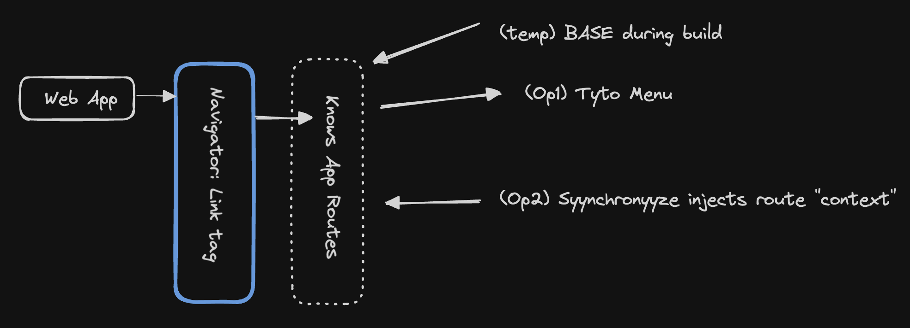

# Navigator

Provides components and functions for doing routing inside applications and to other applications in Tryyb and more. While this can 
be used for any anchor tag it is designed to work best for links to an
other application in Tryyb regardless of it is a SpaceDock'd application. 

**FIG 1.A**

## Configuration and Domains
As seen with FIG 1.A above, this package will grow in internal complexity of features and conncetion with Tryyb while remaining simple to interface with.

Currently to change the domain simple set `VITE_TRYYB_BASE_URL` environment variable. 
